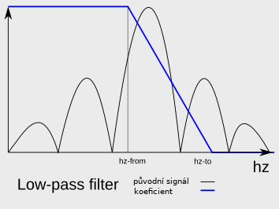

```
ffteq
Filip Kastl, II. ročník
zimní semestr 2021/22
Programování v jazyce C# NPRG035
```

# ffteq - Frekvenční filtr založený na FFT

## Uživatelská dokumentace

### Co to je

Při upravování zvukových souborů se často hodí pracovat s frekvencemi. Je
užitečné z nahrávky odstranit hluboký šum nebo vysoké pískání. K tomu se
používají takzvané filtry. Filtry mohou být také užitečné při práci s hudbou
pro umělecký efekt. To je důvod, proč toto téma zajímá mě.

Program slouží k upravování 8bit 44,1kHz pcm mono zvukových souborů formátu
Wave (.wav). Umí aplikovat low-pass filter (filtruje vysoké frekvence),
high-pass filter (filtruje nízké frekvence) a upravit hlasitost souboru.
Uživatel si na příkazové řádce navolí, které efekty a v jakém pořadí na soubor
aplikovat.

### Jak to spustit

Program lze spustit na Windows a Linux x86\_64 strojích.

#### Windows

Připravte si 8bit 44,1kHz mono Wave soubor. Stáhněte si win-64 release.
Otevřete v kořenové složce terminál. Zadejte následující příkaz (pozor! pokud
výstupní soubor už existuje, program ho přemaže).

```
ffteq <vstupní soubor>.wav <výstupní soubor>.wav gain 0
```

Tímto jste překopírovali vstupní soubor do výstupního.

#### Linux

Postup je stejný jako pro Windows. Jen chcete linux-64 release.

```
./ffteq <vstupní soubor>.wav <výstupní soubor>.wav gain 0
```

### Jak aplikovat efekty

První dva terminálové argumenty jsou vždy cesta ke vstupnímu souboru a cesta k
výstupnímu souboru. Následuje seznam options oddělených mezerami. Každá option
odpovídá aplikaci jednoho efektu. Options se mohou v seznamu opakovat. Jsou
aplikovány v tom pořadí, v jakém jsou zadány v terminálu.

Každá option má formu `<název option> <argument1> <argument2> ...`.

#### filterlo - Low-pass filter

```
filterlo <hz-from> <hz-to>
```

\<hz-from\> a \<hz-to\> jsou desetinná čísla. Zcela odfiltruje frekvence vyšší
než \<hz-to\>. Aby úprava nebyla tak agresivní, začíná filtrovat už na
frekvenci \<hz-from\> a se zvyšující se frekvencí lineárně snižuje koeficient,
kterým násobí vstupní frekvence, až se dostane na nulu v \<hz-to\>.



#### Příklad

```
ffteq <vstupní soubor>.wav <výstupní soubor>.wav filterlo 2000 2500
```

Začne filtrovat na 2000hz. Výstupní soubor nebude obsahovat žádné frekvence
vyšší než 2500hz.

#### filterhi - High-pass filter

```
filterhi <hz-from> <hz-to>
```

Obdobný jako low-pass filter. Zcela odfiltruje frekvence **nižší než
\<hz-from\>**.


#### Příklad

```
ffteq <vstupní soubor>.wav <výstupní soubor>.wav filterhi 3000 3500
```

Výstupní soubor nebude obsahovat žádné frekvence nižší než 3000hz. Filter také
ovlivní frekvence do 3500hz. Od 3500hz zůstanou frekvence jako ve vstupním
souboru.

#### gain - Hlasitost

```
gain <db>
```

Zvýší nebo sníží (v případě záporné hodnoty) hlasitost celého souboru o \<db\>
decibelů.

#### Příklad

```
ffteq <vstupní soubor>.wav <výstupní soubor>.wav gain -5 filterlo 2000 2500
```

Před aplikováním low-pass filtru je snížena hlasitost o 5 decibelů.

### Jak si opatřit správný Wave soubor

Jedním způsobem je použít free open source software Audacity.
1. Opatřete si zvukový soubor
2. Otevřete ho pomocí Audacity
3. Pokud je to stereo soubor, použijte možnost Split Stereo to Mono
4. Vyexportujte soubor jako WAV -> Other uncopressed files
   - Header: WAV (Microsoft)
   - Encoding: Unsigned 8-bit PCM

Další možností je použít některý z předpřipravených souborů ve složce
`testfiles`.

## Programátorská dokumentace

Viz soubor `docs/programmer.pdf`.

## Testovací soubory

Ve složce `testfiles` jsou připravené zvukové soubory, na kterých program může
být ozkoušen. Soubory pocházejí původně z
[https://soundbible.com](https://soundbible.com). Jsou zkonvertované na 8bit
mono pcm. Ty s příponami '-lowpass', '-highpass' a '-loud' jsou upravené pomocí
ffteq.
